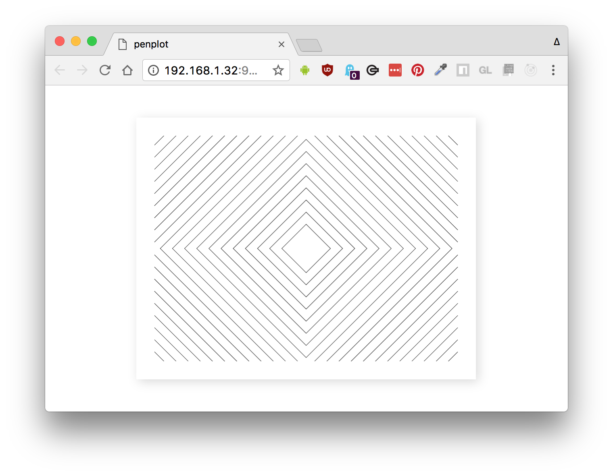
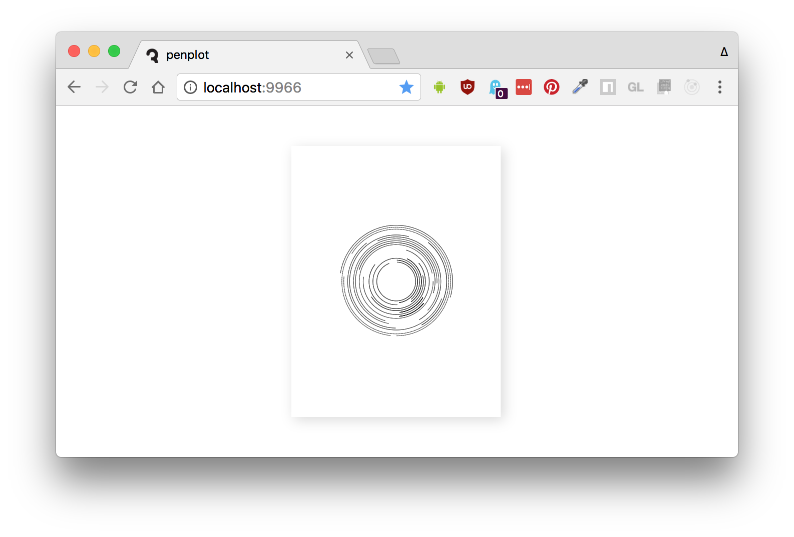
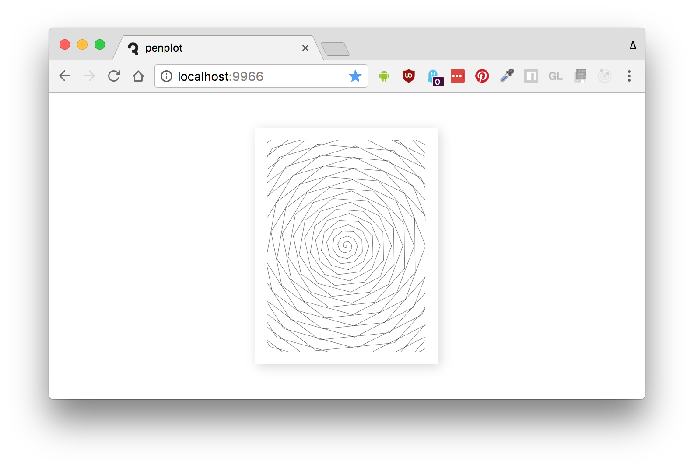
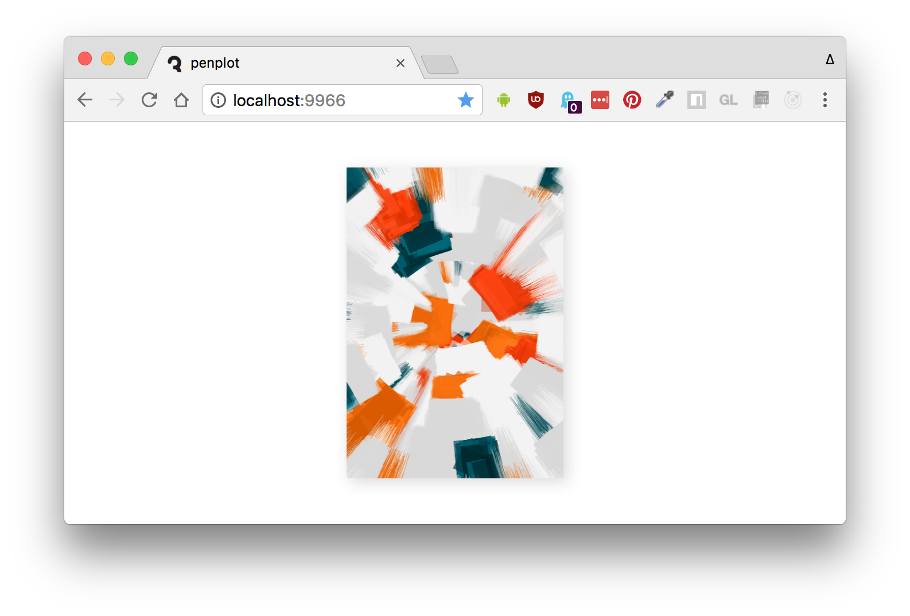

# penplot

[](http://github.com/badges/stability-badges)

An experimental and highly opinionated development environment for generative and pen plotter art.

Some features:

- Zero configuration: just run a command and start writing `<canvas>` renderings
- Fast live-reload on file save
- Hotkey for high-quality PNG output
- Hotkey for SVG rendering
- A builtin library of utilities for random numbers, geometry tools, SVG exporting, and other functions
- Easy integration with Inkscape and AxiDraw v3
- Plots can be rendered in Node.js instead of the browser, sometimes useful for huge print sizes where the browser may have more strict memory limits

## Quick Start

You can install this with npm.

```sh
npm install penplot -g
```

Here is a simple command you can use to quick-start a new plot:

```sh
penplot src/index.js --write --open
```

This will write a new `src/index.js` file and open `localhost:9966`. Now start editing your `index.js` file to see the LiveReload in action.



While in your browser session, you can hit `Cmd/Ctrl + P` to export the SVG to a file in your Downloads folder, or `Cmd/Ctrl + S` to save a PNG file.

The SVG should be formatted to fit a Letter size paper with a pen plotter like AxiDraw V3.

## Penplot Modules

The *penplot* tool is both a development environment and kitchen sink of utility functions. It tries to make some aspects easier for you, like sizing and printing to SVG or PNG.

The `--write` flag generates a simple plot that looks like this:

```js
// Some handy functions & constants
import { PaperSize, Orientation } from 'penplot';
import { polylinesToSVG } from 'penplot/util/svg';
import { clipPolylinesToBox } from 'penplot/util/geom';

// Export the paper layout & dimensions for penplot to set up
export const orientation = Orientation.LANDSCAPE;
export const dimensions = PaperSize.LETTER;

// The plot functiond defines how the artwork will look
export default function createPlot (context, dimensions) {
  const [ width, height ] = dimensions;
  let lines = [];

  // Add [ x, y ] points to the array of lines
  // e.g. [ [ 5, 2 ], [ 2, 3 ] ] is one line
  ... algorithmic code ...

  // Clip all the lines to a 1.5 cm margin for our pen plotter
  const margin = 1.5;
  const box = [ margin, margin, width - margin, height - margin ];
  lines = clipPolylinesToBox(lines, box);

  return {
    draw,
    print,
    background: 'white' // used when exporting the canvas to PNG
  };

  function draw () {
    lines.forEach(points => {
      context.beginPath();
      points.forEach(p => context.lineTo(p[0], p[1]));
      context.stroke();
    });
  }

  function print () {
    return polylinesToSVG(lines, {
      dimensions
    });
  }
}
```

All units here are in centimeters (including `width` and `height`), which makes it easy to reason about things like line thickness and distances.

Using an array of line primitives, you can build up complex prints that can be easily exported to SVG or PNG. However, this means everything will be built from line segments; e.g. circles are generated with `cos()` and `sin()`.

See the [Some Examples](#some-examples) for more inspiration.

## More Commands

Here are some commands you can try.

```sh
# stub out a new file called plot.js
penplot plot.js --write

# run plot.js and open the browser
penplot plot.js --open

# set the output folder for SVG/PNG files
penplot plot.js --output=tmp

# generate a PNG with Node.js
penplot plot.js --node

# write PNG to stdout
penplot plot.js --node --stdout > file.png

# write PNG to custom output folder
penplot plot.js --node --output=tmp 
```

## Node.js

You can also use this as a tool for developing algorithmic/generative art. For example, you can develop the artwork in a browser for LiveReload and fast iterations, and when you want to print it you can set the dimensions and output size like so:

```js
// desired orientation
export const orientation = Orientation.PORTRAIT;

// desired dimensions in CM (used for aspect ratio)
export const dimensions = PaperSize.LETTER;

// your artwork
export default function createPlot (context, dimensions) {
  // your artwork...

  return {
    outputSize: '300 dpi'
  }
}
```

Then, use the `--node` flag to run the plot with `node-canvas`, assuming none of your code is browser-specific.

```sh
penplot my-plot.js --node --stdout > render.png
```

The `outputSize` option can be any of the following:

- a string with DPI resolution like `'300dpi'` or `'72 DPI'`
- a single number to use as the pixel width; in this case the height is computed automatically based on the `dimensions` aspect
- an array of `[ width, height ]`, where either (or both) can be specified as pixel sizes. If you specify `'auto'`, `-1` or `null` as a dimension, it will be computed automatically based on the aspect ratio

The default output width is 1280 px.

## Some Examples

In the [example](./example) folder you will find some variations of plots.

##### [simple-circles.js](./example/simple-circles.js)



This example shows the basics of using *penplot* for hardware like AxiDraw V3. You can run it like so:

```sh
penplot example/simple-circles.js --open
```

And hit `Cmd/Ctrl + S` or `Cmd/Ctrl + P` to save a PNG or SVG file, respectively.

##### [swirling-circles.js](./example/swirling-circles.js)



This example shows how you can use a built-in function `clipPolylinesToBox` in `penplot/util/geom.js` to clip the lines to a margin.

##### [generative-paint.js](./example/generative-paint.js)



This example shows a more complex algorithmic artwork, and how you can use penplot as a development environment for print-size generative art even when you have no plans to print it to a pen plotter.

The `outputSize` parameter in this demo is set to `'300 dpi'`, which will convert the `dimensions` and `orientation` to a pixel size suitable for print when saving to PNG.

## License

MIT, see [LICENSE.md](http://github.com/mattdesl/penplot/blob/master/LICENSE.md) for details.
